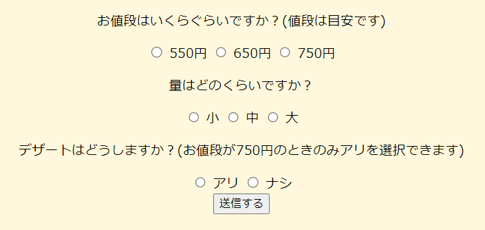

 # プロダクト名：学メシアドバイザー

<!-- イメージ画像を置いてください -->

## チーム名：チーム3 - 9時17時サラリーマン
<!-- チーム番号とチーム名を変更してください -->

## 背景・課題・解決されること
<!-- 考案するプロダクトがどういった(Why)背景から思いついたのか、どのよう(What)な課題があり、どのよう(How)に解決するのかを入力してください -->
立命館大学の生協の食堂には主菜・麺・丼・カレー・副菜など、色々なメニューがあり毎日の楽しみである。 
が、我々は学生の身なので、食事にそこまでのお金をかけられない。そのため、、毎日お昼ご飯や晩御飯に何を食べるのか悩んでいる。 
そこで、「メニューを自動で提案してくれるものがあればな～」という思いからこの学メシアドバイザーを作成した。 
これにより生協の食堂前で何を食べようか迷って看板の前をウロウロすることが減り、普段食べないような新しいメニューにもチャレンジできるようになる。 
さらに、何を食べたかなどもわかるため健康管理もできる。

## プロダクト説明 
<!-- 開発したプロダクトの説明を入力してください -->
学メシアドバイザーは、webページである。 
主な機能として以下があげられる 
- オススメのメニュー表示機能
    - 文面のとおり、オススメのメニューを表示する機能
    - 入力するのはお金（550/650/750）・量（大・中・小）・デザートの有無（あり・なし。※デザートは￥750のときのみ選択できる。）の3つ。
    - 毎回、ランダムな組み合わせを出力する。
    - 記録機能により得られたデータを参照し、記録で食べてないものをよりオススメする
        -（例）今週、麵・丼ばかり食べていると、主菜がでる確率が上がる
    - 
- 食べたものを記録する機能
    - 名前のとおり食べたものを記録する機能
    - 

## 操作説明・デモ動画
<!-- 開発したプロダクトの操作説明について入力してください。また、操作説明デモ動画があれば、埋め込みやリンクを記載してください -->
### オススメのメニュー表示機能

こちらはトップページに存在する３つの質問（値段・量・デザート）に答えていくだけ。
”送信”ボタンを押すとオススメメニューが表示される。

### 食べたものを記録する機能

ホーム画面では画像や栄養や名前などがまとまって表示され、最後に合計金額や栄養素が表示されます。 
細かな点として、色を生協アプリに合わせて作成しました。 
遷移ページはhtmlのみで作成しており、バックエンド側の関数を読み込むことで表示しています。 
あとは、料理の毎に画像や名称、価格、カロリーを分かりやすく表示しました。

## 注力したポイント・工夫点
<!-- 開発したプロダクトの注力したポイント・工夫点を入力してください -->
### オススメのメニュー表示機能
- 記録から何をどれだけ食べたか参照し、あまり食べていないものをオススメする！！！
- 評価総数が多いものをよりオススメする！！！

### 食べたものを記録する機能

## 使用技術
<!-- 開発したプロダクトの使用技術を入力してください -->
- HTML/CSS
- python
- flask 
- SQLite
- JavaScript

<!--
markdownの記法はこちらを参照してください！
https://docs.github.com/ja/get-started/writing-on-github/getting-started-with-writing-and-formatting-on-github/basic-writing-and-formatting-syntax
-->
